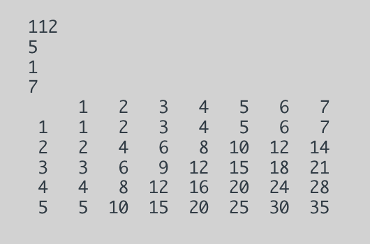

# Multiplication-Table
## Using loops and iomanip library, create a multiplication table with user input.

- Creating the multiplication toold after user inputted c and r for column # and row #. 
- see code snippet below

```
cout << setw(3) << " ";
    for (firstRow = 1; firstRow <= c; firstRow++) {
        cout << setw(3) << firstRow;
    }
    cout << endl;
    // Table
    for (firstRow = 1; firstRow <= r; firstRow++) {
        cout << setw(3) << firstRow;
        for (firstCol = 1; firstCol <= c; firstCol++) {
                cout << setw(3) << firstRow * firstCol;
        }
        cout << endl;
    }
```


## An Example Result of multiplication table 



- Emily Holt
- [LinkedIn](https://www.linkedin.com/in/emily-holt-bb70b8161/)
